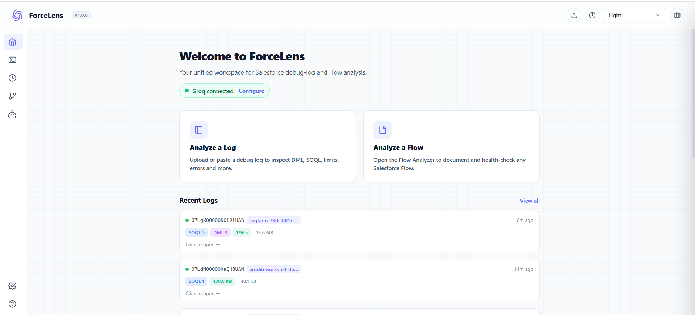
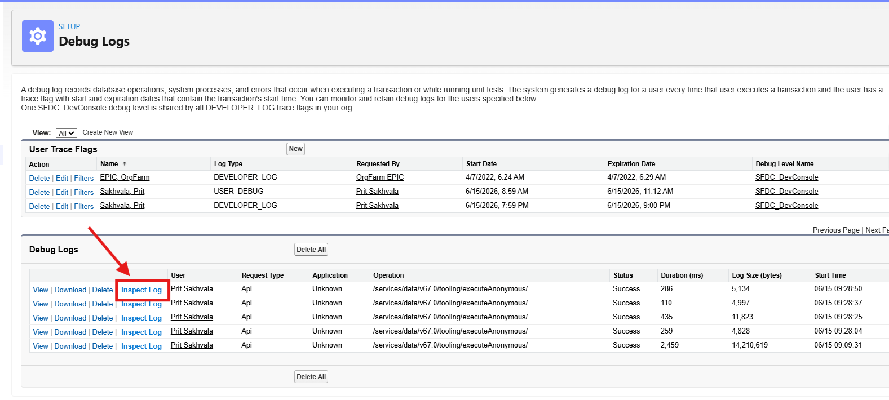
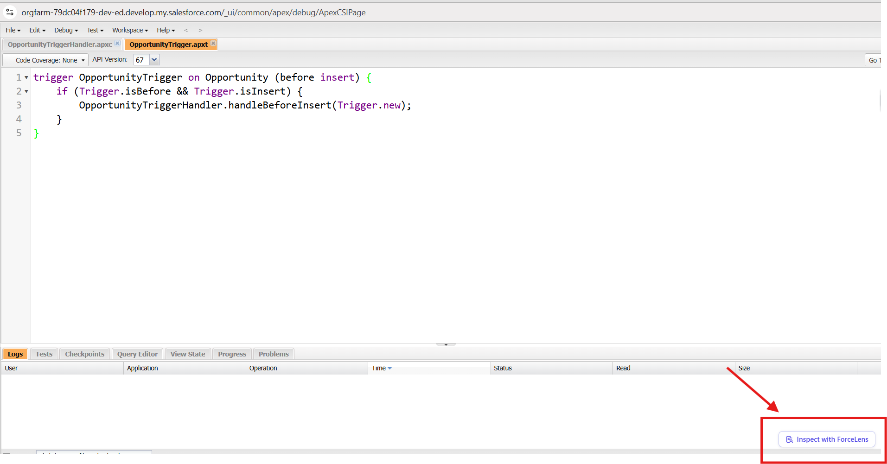

# 
 ForceLens

  <strong>Salesforce Apex & Flow Intelligence Engine</strong>

  
  
  
  

  <strong>Stop reading logs. Start seeing the execution.</strong>

  ForceLens turns raw, line-by-line Salesforce Apex logs into the exact order of execution — triggers, flows, queries, and limits — and explains it with the AI model you already pay for. Bring your own key. 100% local-first.

---

## ✦ Why ForceLens?

Salesforce Developer Console shows you raw logs. Every other tool makes you copy log IDs, hunt down trace flags, open new tabs, and dig for logs. 

**ForceLens collapses that entire ritual into a single action.** It is not just a log viewer; it is an intelligence layer that meets you exactly where your eyes already are.

  

---

## ⚡ Core Features

### 1. One-Click "Smart Capture"
No more manually setting up trace flags or hunting for logs in Setup. Click **Smart Capture**, run your transaction, and ForceLens captures, groups, and displays the log automatically without you ever leaving the page.

### 2. True Order of Execution
ForceLens reconstructs Salesforce's true execution flow. See exactly when before/after triggers, validation rules, flows, workflows, and roll-ups fired, and how limits were consumed at every single step.

### 3. One Flow, Four Expert Lenses
Hand any Flow to ForceLens and choose a perspective:
- **Developer Lens**: Null-handling, loop-bulkification, fault paths, and query optimization.
- **Business Analyst Lens**: Translates complex Flow logic into human-readable business rules.
- **QA Lens**: Auto-generates test scenarios, edge cases, and user acceptance criteria.
- **Security Lens**: Flags insecure patterns, DML access risks, and privilege elevation.
Export complete reports directly as `.docx` files.

### 4. Bring Your Own Key (BYOK) AI
Configure your own API keys for **Claude, GPT-4o, Groq, or OpenRouter**. All AI queries go directly from your browser to the provider — no middleman servers, no markup fees, and complete data isolation.

### 5. Local-First History
Your last 200 analyzed sessions are saved in your browser's local storage. Filter by org, log ID, or date, and resume debugging instantly.

---

## 🛡️ Security & Privacy First

We believe developer tools should never expose proprietary code or client logs. 
* **Zero Telemetry Servers**: ForceLens has no backend server. Your logs are parsed inside your browser sandbox.
* **Direct AI Connection**: Outbound calls to AI providers (Anthropic, OpenAI, Groq, OpenRouter) are made directly from your browser.
* **Encrypted Local Storage**: Your API keys and historical logs are stored safely within Chrome’s secure local storage.

---

## 🚀 How It Integrates

ForceLens adds a single, powerful **"Inspect Log"** button in the three places your eyes already live:

1. **Debug Logs List Table** (Setup)
2. **Debug Log Detail Page** (Setup)
3. **Developer Console Log Tab Strip**
4. **Salesforce Flow Builder Canvas**

   &nbsp;
  

---

## 🛠️ Getting Started

### Installation
1. Search **ForceLens** in the [Chrome Web Store](https://chrome.google.com/webstore).
2. Click **Add to Chrome**.
3. Open any Salesforce Sandbox, Scratch Org, Developer Edition, or Production environment.

### Setup AI (Optional)
1. Click the ForceLens extension icon.
2. Select **Settings** (or **Configure AI**).
3. Insert your API Key for Claude, GPT, Groq, or OpenRouter.
4. Save key (stored locally).

---

## 🌐 Works Everywhere
- Lightning Experience & Salesforce Classic
- Developer Console & Flow Builder
- Developer, Sandbox, Scratch, and Production Environments

---

## 📄 License
Distributed under the MIT License. See [LICENSE](file:///c:/Users/HP/Desktop/ForceLense%20Site/LICENSE) for more information.

---

## 👥 Crafted By
Designed and crafted with ❤️ by **[Prit Sakhvala](https://github.com/sakhvalaps)**, Salesforce Developer.
